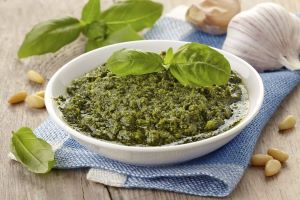

*FRENCH VERSION*

### Pasta with pesto sauce

Pasta and pesto, one of Italy's signature pasta dishes and one of the tastiest summer recipes ever. Let's face it
genovese pesto is always a feast, but when it's authentic, prepared with the right ingredients and the
technique, it's a whole different story. 
Traditional Genovese pesto is prepared in a marble mortar, where small, tender Genovese basil leaves are crushed with garlic 
garlic, pine nuts, coarse salt and extra virgin olive oil. 
Don't worry, it can also be prepared using a blender... the important thing is to observe a few precautions and choose the 
ingredients.

Here's the full recipe!

#### Ingredients
- 70 gr Genovese basil 
- 50 g _parmesan_
- 30 g pine nuts
- salt
- 70 g extra-virgin olive oil

#### Preparation
1. Rinse basil leaves briefly in cold water, then place on a tea towel and pat dry.
   gently rubbing.
2. Crush the pine nuts, and when ready, do the same with the basil leaves and salt.
3. Always start with percussive movements and continue with rotary movements.
4. When the consistency is creamy and homogeneous, add the Parmesan and blend in the same way.
5. When all the ingredients have been reduced to a creamy consistency, pour in the oil and rotate the pestle for a few moments longer.
6. Your pesto is ready to use!

[Homepage](README.md)

[Recipes from Apulia](apulia.md)
